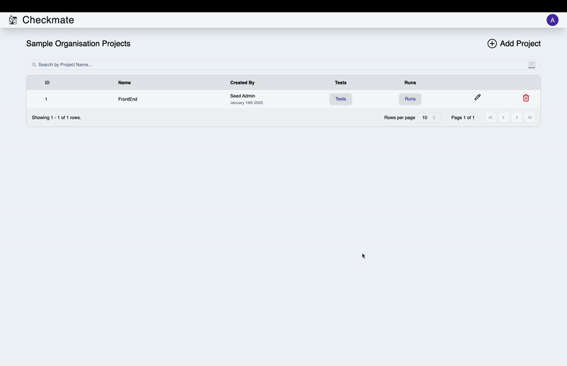
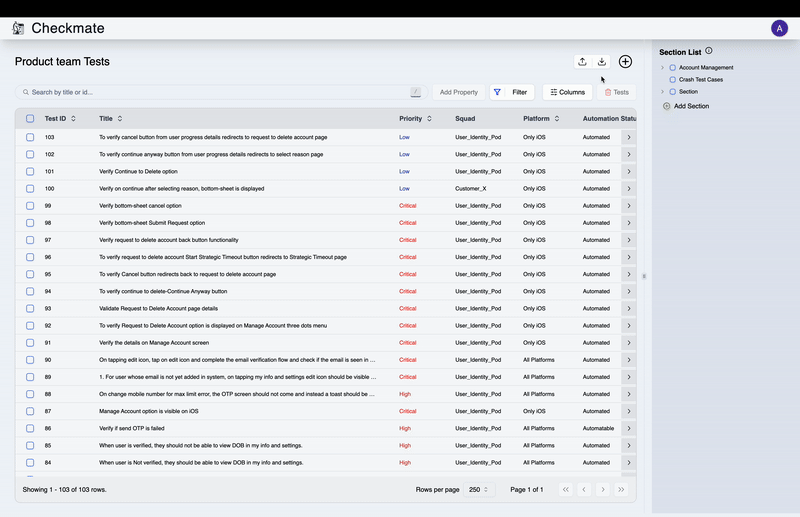
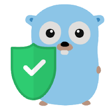

# Checkmate - Test Case Management Tool

Welcome to Checkmate! 🎉

This Test Case Management Tool is designed to address the challenges faced by teams in managing and executing test cases with the highest level of availability and reliability. It aims to streamline the testing process, offering robust features, seamless integrations, migration, and user-friendly and intuitive design.

## 📌 Features

- ✅ Effortlessly manage test cases and categorize them based on labels, squads, sections, priority, and more.
- ✅ Create test runs, update statuses, track progress, download reports, and analyze historical data.
- ✅ Provides integration APIs to seamlessly connect with your testing pipeline.
- ✅ Role-Based Access Control (RBAC) for secure and controlled usage.
- ✅ Integrated Google Login for a hassle-free authentication experience.

## 🔗 Quick Links

- [Detailed Documentation](https://checkmate.dreamsportslabs.com/)
- [Installation Guide](https://checkmate.dreamsportslabs.com/project/setup/)
- [Product Guide](https://checkmate.dreamsportslabs.com/guides/projects/)
- [Connect with us on discord](https://discord.com/channels/1317172052179943504/1329754684730380340)

## 📦 Installation

### Pre-requisites

1. Docker Desktop
2. Google OAuth Application

### Docker Setup

1. Clone the repository:
   ```sh
   git clone git@github.com:dream-sports-labs/checkmate.git
   ```
2. Create an .env file at root level, based on .env.example.
3. Install dependencies
   ```sh
   yarn install
   ```
4. Set up the application and database:
   ```sh
   yarn docker:setup
   ```
   - Create both the application and database containers using Docker.
   - Seed the database with initial data.
5. App will be started on http://localhost:3000

### ⏯️ Product Videos

   <details>
   <summary>Create Projects</summary>



   </details>
<details>
    <summary>Add Tests</summary>
  

</details>
<details>
    <summary>Create Runs</summary>



</details>
<details>
    <summary>Manage Runs</summary>


</details>

### 📖 API Documentation

Postman collection of project APIs is currently on [discord](https://discord.com/channels/1317172052179943504/1329754684730380340), complete documentation is in progress.

### ⚙️ TechStack Used:

- <span style="display: flex; align-items: center;">
   
  <a href="https://remix.run/" target="_blank">Remix</a>
  </span>

- <span style="display: flex; align-items: center;">
   
  <a href="https://orm.drizzle.team/" target="_blank">Drizzle</a>
  </span>

- <span style="display: flex; align-items: center;">
   
  <a href="https://www.mysql.com/" target="_blank">MySQL</a>
  </span>

- <span style="display: flex; align-items: center;">
   
  <a href="https://ui.shadcn.com/" target="_blank">Shadcn</a>
  </span>

- <span style="display: flex; align-items: center;">
   
  <a href="https://casbin.org/" target="_blank">Casbin (RBAC)</a>
  </span>

##  Created by DreamSportsLabs

DreamSportsLabs is committed to building open-source tools that empower developers and businesses. Learn more about us at our website.

## 🚀 Contribute to Checkmate

Checkmate is an open-source project and welcomes contributions from the community. For details on how to contribute, please see our [guide to contributing](/CONTRIBUTING.md).

## ⚖️ License

This project is published under the [MIT License](/LICENSE).

## ✉️ Contact

If you need feedback or support, reach out via the [Issue Tracker](https://github.com/dream-sports-labs/checkmate/issues) or [Discord](https://discord.com/channels/1317172052179943504/1329754684730380340).
