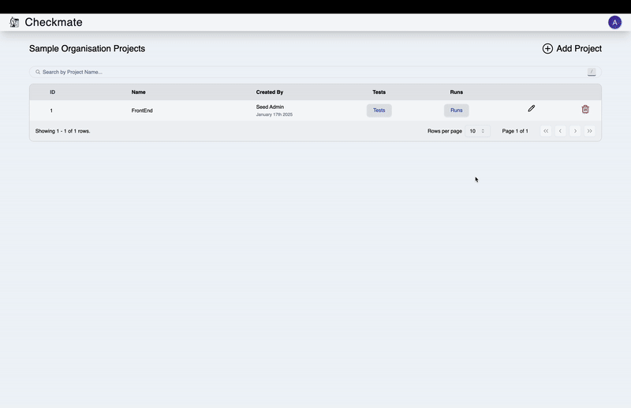
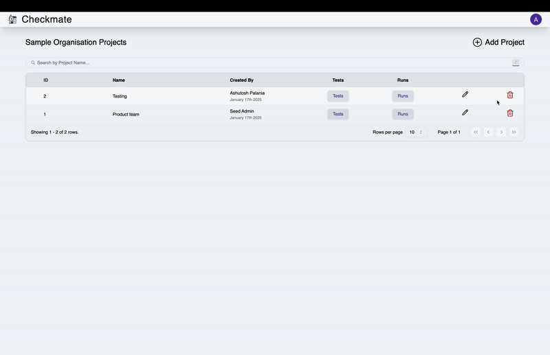

This section outlines the steps to **create**, **edit**, and **delete projects** seamlessly using Checkmate.

---

### 1. Creating a Project

To create a new project, follow these steps:

1. Click the **Add Project** button.
2. You will be directed to the project creation page.
3. Enter the required information.
   > **Note:** The project name must contain at least **5 characters**.
4. Once all fields are completed, click **Create**.

If the project is successfully created, a notification will appear with the message: **"Project Added"**.

  
Video Tutorial

  

---

### 2. Editing a Project

To modify an existing project, proceed as follows:

1. Locate the project in the table and click the **Pencil Icon**.
2. An editable pop-up form will appear.
3. Update the required fields with the new details.
4. Click **Save Changes** to confirm.

Upon successful editing, a notification will appear with the message: **"Success"**. The changes will immediately reflect in the project table.

  
Video Tutorial

  

---

### 3. Deleting a Project

To remove a project, take the following steps:

1. Locate the project in the table and click the **Delete Icon**.
2. A confirmation dialog will appear.
3. Click **Yes, Delete** to confirm the action.

If the deletion is successful, a notification will appear with the message: **"Success"**.

  
Video Tutorial

  

---

This guide provides a straightforward approach to managing projects in Checkmate, ensuring an intuitive and efficient workflow for your team.
