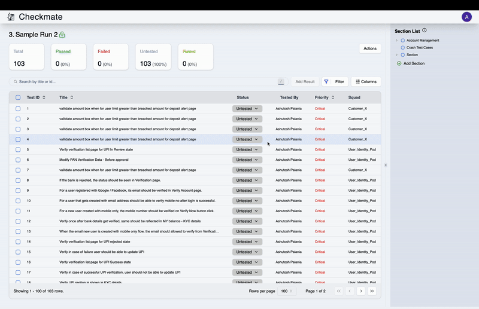
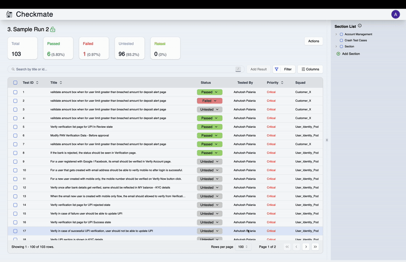
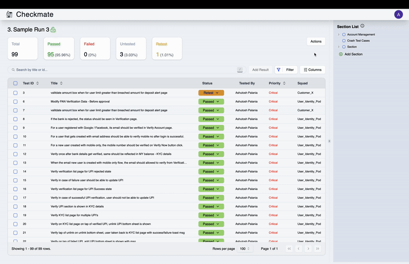
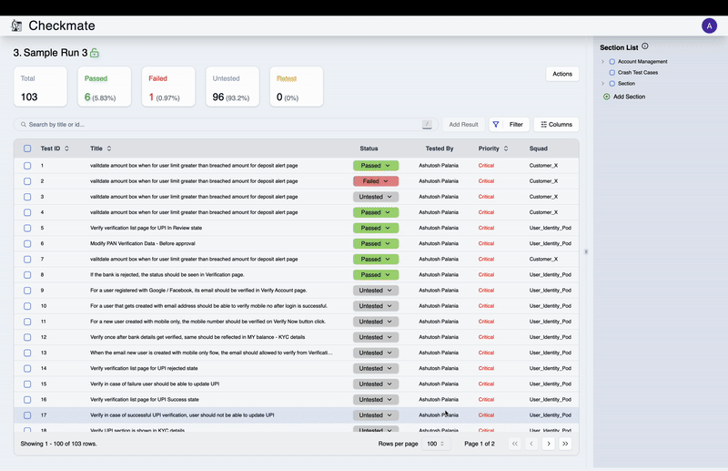
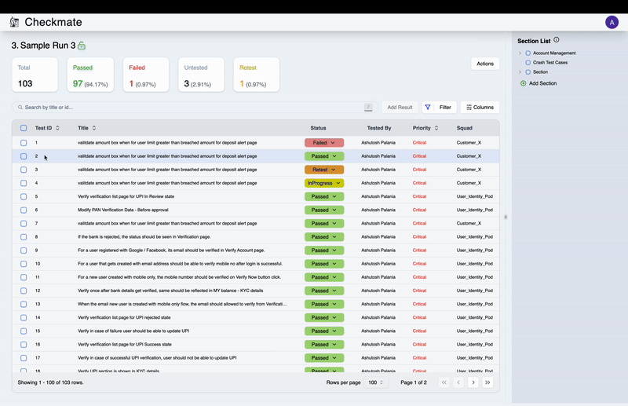

This guide provides detailed instructions for managing test runs, including updating test statuses, batch updates, editing, locking, resetting runs, and removing tests.

---

### Manage Test Status

#### Update Test Status (Individual)

1. Locate the test in the **Runs Page**.
2. Click on the **Status Button** in the row of the test.
3. Select the desired status from the dropdown.
4. Click **Add Result** to update the status.

#### Batch Update

1. Select multiple tests from the list.
2. Click the **Add Result** button at the top of the page.
3. Choose the status for all selected tests, and confirm the update.

  
Video Tutorial

  

---

### Manage Runs

#### Edit Run

1. Click on the **Actions** button and select **Edit**.
2. Modify the following fields:
   - **Run Name**
   - **Run Description**
3. Click **Save Edits** to apply changes.

  
Video Tutorial

  

---

#### Lock Run

1. Click on the **Actions** button and select **Lock**.
2. In the confirmation pop-up, click **Lock Run** to proceed.
   - Once locked, no further changes can be made to the run.
3. You can download the run's report in `.csv` format using the **Download** button.

  
Video Tutorial

  

---

#### Reset Run

1. Click on the **Actions** button and select **Reset Run**.
2. In the confirmation dialog, click **Reset Run** to proceed.
   - This will mark all tests with the status **Passed** as **Retest**.

  
Video Tutorial

  

---

#### Remove Tests from Run

1. Select the tests you want to remove from the list.
2. Open the **Actions Dropdown** and select **Remove Test**.
3. Click **Remove Tests** to confirm.

   - The selected tests will be removed from the run.

  
Video Tutorial

  

---

#### Notes

- **Lock Run** ensures the run becomes immutable for further changes.
- **Reset Run** is useful for re-evaluating previously passed tests.
- Test reports can be downloaded in `.csv` format for further analysis.

This guide ensures a streamlined process for managing test runs and test statuses within Checkmate. For additional assistance, contact your system administrator or support team.
