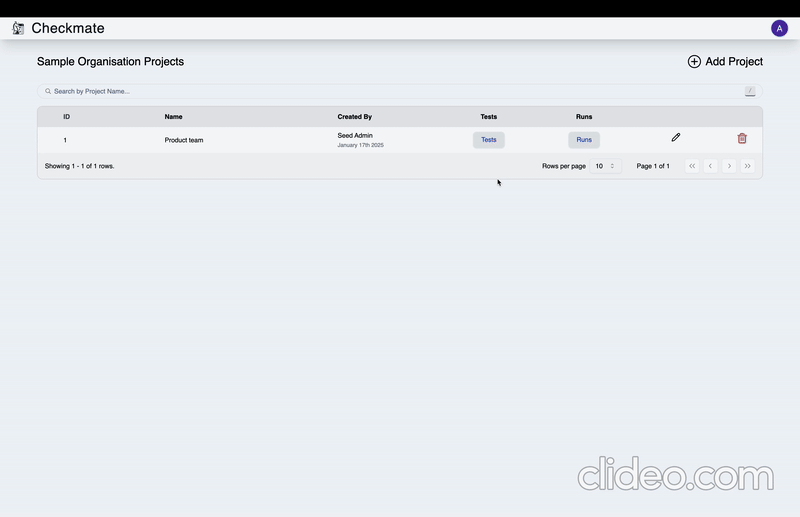
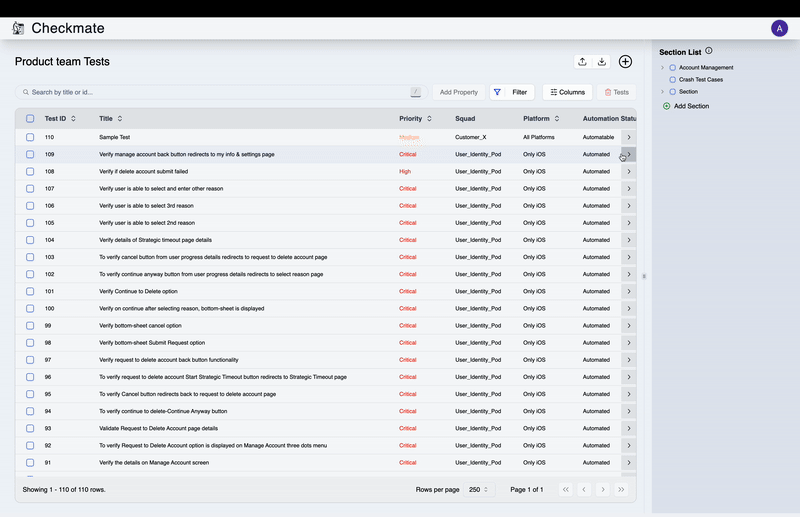
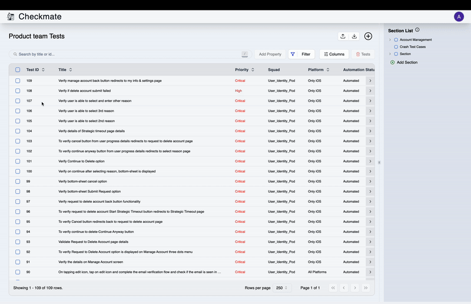
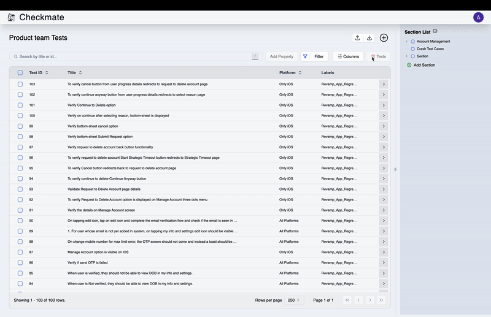

Managing test cases effectively is a crucial part of test management. This guide provides step-by-step instructions for **creating**, **editing**, and **deleting** test cases, both individually and in bulk, as well as for adding labels, squads, and runs.

### Managing Single Test Cases

#### 1. Creating a Test Case

1. Navigate to the **Tests Listing Page**.
2. Click on **Add Test**.
3. Provide the following details:
   - **Mandatory Fields**: Title and Section.
   - **Default Fields**: Priority, Automation Status, Platform, Test Covered By (adjust as needed).
   - **Optional Fields**: Fill in additional attributes if required.
4. Choose one of the following actions:
   - **Add Test Case**: Adds the test and navigates to the **Tests Listing Page**.
   - **Add & Next**: Adds the test and opens a fresh **Add Test Page**.
   - **Cancel**: Returns to the **Tests Listing Page** without saving.

> **Note**: _Section_ and _Squad_ can be added by if not exist

  
Video Tutorial

  

#### 2. Editing a Test Case

1. On the **Tests Listing Page**, click the **Edit** button next to the desired test.
2. Update the required fields with the new details.
3. Choose one of the following actions:
   - **Update Test**: Saves the changes.
   - **Cancel**: Returns to the **Tests Listing Page** without saving.

  
Video Tutorial

  

#### 3. Deleting a Test Case

1. On the **Tests Listing Page**, click the **Delete** button next to the test.
2. Confirm the deletion in the confirmation dialog.

  
Video Tutorial

  

### Managing Multiple Test Cases

#### 1. Deleting Multiple Test Cases

1. Select the tests on the **Tests Listing Page**.
2. Click the **Delete Tests** button.
3. Confirm the deletion in the dialog box.

  
Video Tutorial

  

#### 2. Changing Attributes for Multiple Test Cases

1. Select the tests on the **Tests Listing Page**.
2. Click **Add Property**.
3. From the dropdown, select a property and its value.
4. Click **Apply**.

   - **For Labels**: Selected label is added to the existing label of test.
   - **For Other Attributes**: Replaces the current value with the selected one.

  
Video Tutorial

  

### Adding Labels, Squads, and Runs

1. Select the relevant field from the dropdown.
2. Fill in the required details.
3. Click **Apply**.

  
Video Tutorial

  

